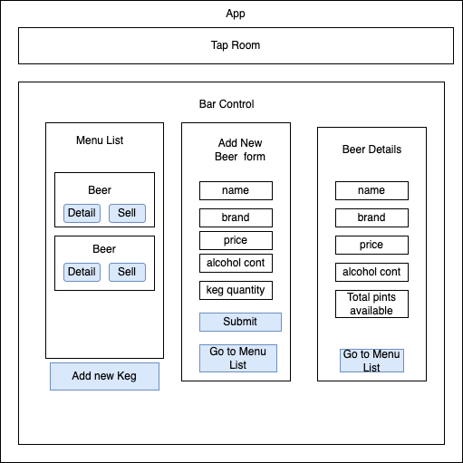

# _Tap Room_

#### _A React application to design a tap room and keep track of drinks_

#### By _**Tiffany Rodrigo**_

## Technologies Used

* _JavaScript_
* _React_
* _HTML_
* _CSS_
* _JSX_

## Description
#### _A tap room in React where a bar or kombucha store can track their kegs. This could also be a soda fountain or another kind of tracker - as long as you're able to track the remaining amount_

## Setup/Installation Requirements

* _Clone this repository by navigating to your desired directory in your command terminal and run $ git colone https://github.com/tiffarodrigs/Tap-Room.git_
* _Navigate to the project directory in the teminal_
* _The site opens in localhost:3000_

## Known Bugs

* _No known issues_

## License

_MIT_

Copyright (c) _Apr 24th 2022_ _Tiffany Rodrigo_